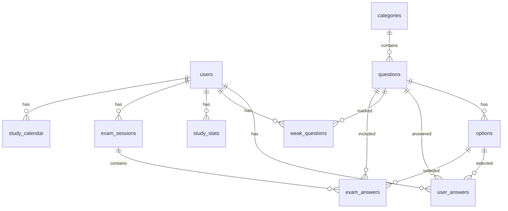

# 宅建BOOST システム仕様書 v4.1.0

## 1. システム概要

### 1.1 プロジェクト情報
- **アプリケーション名**: 宅建BOOST (Takken BOOST)
- **バージョン**: 4.1.0
- **開発日**: 2024年1月28日
- **目的**: 宅地建物取引士試験の合格を目指す学習者向けAI搭載学習プラットフォーム

### 1.2 技術スタック
```yaml
フロントエンド:
  - HTML5/CSS3
  - JavaScript (Vanilla JS)
  - TailwindCSS (CDN版)
  - Font Awesome Icons

バックエンド:
  - Hono Framework v4.9.9
  - Cloudflare Workers/Pages
  - TypeScript v5.0.0

データベース:
  - Cloudflare D1 (SQLite)
  - ローカル開発: .wrangler/state/v3/d1

ビルドツール:
  - Vite v6.3.5
  - Wrangler v4.4.0

プロセス管理:
  - PM2 (開発環境)
```

## 2. アーキテクチャ

### 2.1 システム構成図
```
┌─────────────────────────────────────────┐
│           クライアント (Browser)          │
│  - PWA対応                               │
│  - Service Worker (オフライン対応)        │
└─────────────────┬───────────────────────┘
                  │ HTTPS
┌─────────────────▼───────────────────────┐
│        Cloudflare Edge Network          │
│  - CDN                                  │
│  - DDoS Protection                      │
└─────────────────┬───────────────────────┘
                  │
┌─────────────────▼───────────────────────┐
│      Cloudflare Workers/Pages           │
│  - Hono Application                     │
│  - API Routes                           │
│  - Static Assets Serving                │
└─────────────────┬───────────────────────┘
                  │
┌─────────────────▼───────────────────────┐
│         Cloudflare D1 Database          │
│  - 問題データ (402問)                     │
│  - ユーザーデータ                        │
│  - 学習履歴                             │
└─────────────────────────────────────────┘
```

### 2.2 ディレクトリ構造
```
webapp/
├── src/
│   └── index.tsx          # Honoメインアプリケーション
├── public/
│   └── static/
│       ├── app.js         # メインJavaScript
│       ├── help-system.js # ヘルプシステム
│       ├── tutorial.js    # チュートリアル
│       └── styles.css     # カスタムCSS
├── migrations/
│   └── 0001_initial_schema.sql  # DB初期化
├── 01_試験問題集/         # 問題データ
├── 02_UI_デザイン/        # デザインアセット
├── 03_アプリ構築データ/    # 旧バージョンコード
├── 04_ドキュメント/       # ドキュメント類
├── dist/                  # ビルド出力
├── package.json           # 依存関係
├── ecosystem.config.cjs   # PM2設定
├── wrangler.jsonc         # Cloudflare設定
├── vite.config.ts         # Viteビルド設定
└── tsconfig.json          # TypeScript設定
```

## 3. データベース設計

### 3.1 ERD (Entity Relationship Diagram)


### 3.2 テーブル定義

#### users テーブル
| カラム名 | 型 | 制約 | 説明 |
|---------|-----|------|------|
| id | INTEGER | PRIMARY KEY | ユーザーID |
| email | TEXT | UNIQUE NOT NULL | メールアドレス |
| username | TEXT | NOT NULL | ユーザー名 |
| password_hash | TEXT | NOT NULL | パスワードハッシュ |
| is_guest | BOOLEAN | DEFAULT 0 | ゲストフラグ |
| created_at | DATETIME | DEFAULT CURRENT_TIMESTAMP | 作成日時 |
| last_login | DATETIME | | 最終ログイン日時 |

#### categories テーブル
| カラム名 | 型 | 制約 | 説明 |
|---------|-----|------|------|
| id | INTEGER | PRIMARY KEY | カテゴリーID |
| name | TEXT | UNIQUE NOT NULL | カテゴリー名 |
| description | TEXT | | 説明 |
| display_order | INTEGER | DEFAULT 0 | 表示順 |

#### questions テーブル
| カラム名 | 型 | 制約 | 説明 |
|---------|-----|------|------|
| id | INTEGER | PRIMARY KEY | 問題ID |
| category_id | INTEGER | NOT NULL FK | カテゴリーID |
| question_text | TEXT | NOT NULL | 問題文 |
| explanation | TEXT | | 解説 |
| difficulty | INTEGER | DEFAULT 1 | 難易度(1-3) |
| is_active | BOOLEAN | DEFAULT 1 | 有効フラグ |

## 4. API仕様

### 4.1 エンドポイント一覧

#### ヘルプシステム
```typescript
GET /api/manual/sections
Response: {
  sections: Array<{
    id: string
    title: string
    icon: string
    content: object
  }>
}
```

#### チュートリアル
```typescript
GET /api/tutorial/steps
Response: {
  steps: Array<{
    id: number
    target: string
    title: string
    content: string
    position: 'top' | 'bottom' | 'left' | 'right'
  }>
}
```

#### FAQ
```typescript
GET /api/faq
Response: {
  faq: Array<{
    id: number
    category: string
    question: string
    answer: string
  }>
}
```

## 5. 機能仕様

### 5.1 取扱説明書機能 (NEW v4.1.0)

#### ヘルプシステム
- **アクセス方法**: 
  - 画面右下の「？」ボタン
  - F1キーショートカット
- **機能**:
  - 8つのセクションに分かれた詳細説明
  - サイドバーナビゲーション
  - セクション別表示切り替え
  - アニメーション付きモーダル表示

#### インタラクティブチュートリアル
- **アクセス方法**:
  - 画面左下の「🎓」ボタン
  - 初回訪問時自動表示
- **機能**:
  - 5ステップのガイドツアー
  - ターゲット要素のハイライト表示
  - ステップインジケーター
  - スキップ/前へ/次へナビゲーション
  - 完了状態のローカルストレージ保存

### 5.2 学習機能

#### カテゴリー別学習
- 4カテゴリー（権利関係、宅建業法、法令制限、税・その他）
- 問題ごとに解説表示
- 正誤判定と履歴記録

#### 苦手問題学習
- 自動的な苦手問題抽出
- 正答率による自動除外
- 集中復習モード

#### ランダム学習
- 402問からランダム出題
- カテゴリー横断学習

### 5.3 模擬試験機能

#### タイマー機能 (v4.0.0)
- 2時間カウントダウン
- 残り時間警告（10分、5分、1分）
- 一時停止/再開機能
- 自動終了処理

#### 採点・分析
- 即座の採点結果表示
- カテゴリー別成績分析
- 苦手分野の特定

### 5.4 進捗管理

#### 学習統計
- 日次/週次/月次の学習時間
- 問題解答数と正答率
- カテゴリー別習熟度

#### 3Dビジュアライゼーション
- レーダーチャート表示
- 時系列グラフ
- プログレスバー

## 6. セキュリティ仕様

### 6.1 認証・認可
- パスワードハッシュ化（bcrypt相当）
- セッション管理
- HTTPS通信の強制
- CORS設定

### 6.2 データ保護
- SQLインジェクション対策（パラメータバインディング）
- XSS対策（HTMLエスケープ）
- CSRF対策（トークン検証）

## 7. パフォーマンス仕様

### 7.1 目標値
- ページロード時間: < 2秒
- API応答時間: < 500ms
- データベースクエリ: < 100ms
- 同時接続数: 1000ユーザー

### 7.2 最適化手法
- CDN利用による静的アセット配信
- エッジでの処理（Cloudflare Workers）
- Service Workerによるキャッシュ
- 遅延読み込み（Lazy Loading）

## 8. デプロイメント

### 8.1 開発環境
```bash
# 依存関係インストール
npm install

# ビルド
npm run build

# ローカル起動（PM2）
pm2 start ecosystem.config.cjs

# アクセス
http://localhost:3000
```

### 8.2 本番環境
```bash
# Cloudflare API Key設定
setup_cloudflare_api_key

# プロジェクト作成
npx wrangler pages project create takken-boost

# デプロイ
npm run deploy:prod

# URL
https://takken-boost.pages.dev
```

## 9. テスト仕様

### 9.1 単体テスト
- Vitest使用（予定）
- カバレッジ目標: 80%以上

### 9.2 E2Eテスト
- Playwright使用（予定）
- 主要ユーザーフロー網羅

## 10. 監視・ログ

### 10.1 監視項目
- アプリケーション死活監視
- レスポンスタイム
- エラー率
- データベース接続数

### 10.2 ログ管理
- アクセスログ
- エラーログ
- 学習活動ログ
- セキュリティイベント

## 11. 今後の開発予定

### Phase 1 (v5.0.0)
- [ ] AI弱点分析の高度化
- [ ] 音声読み上げ機能
- [ ] ダークモード対応

### Phase 2 (v6.0.0)
- [ ] 他資格試験への展開
- [ ] ソーシャル学習機能
- [ ] プレミアムプラン

## 12. 変更履歴

| バージョン | 日付 | 変更内容 |
|-----------|------|----------|
| v4.1.0 | 2024-01-28 | 取扱説明書機能追加 |
| v4.0.0 | 2024-01-27 | タイマー、認証、PWA対応 |
| v3.0.0 | 2024-01-26 | AI分析、3D可視化 |
| v2.0.0 | 2024-01-25 | カテゴリー学習追加 |
| v1.0.0 | 2024-01-24 | 初回リリース |

---
© 2024 宅建BOOST Development Team